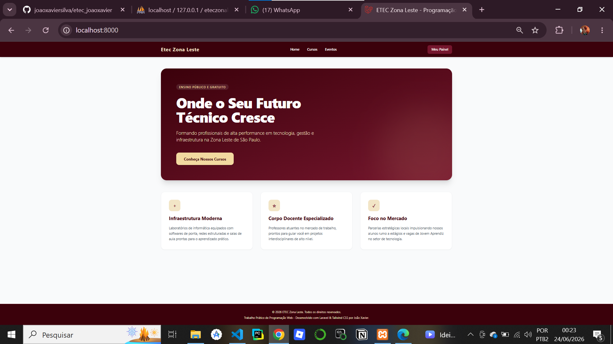
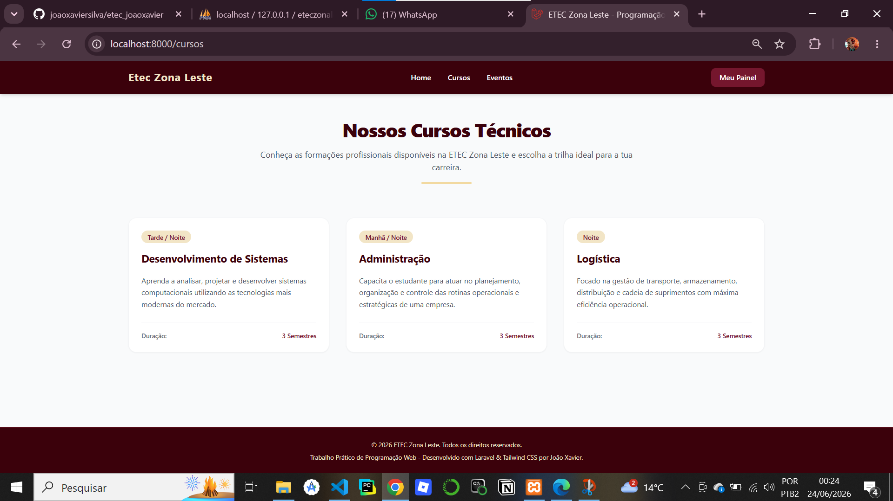
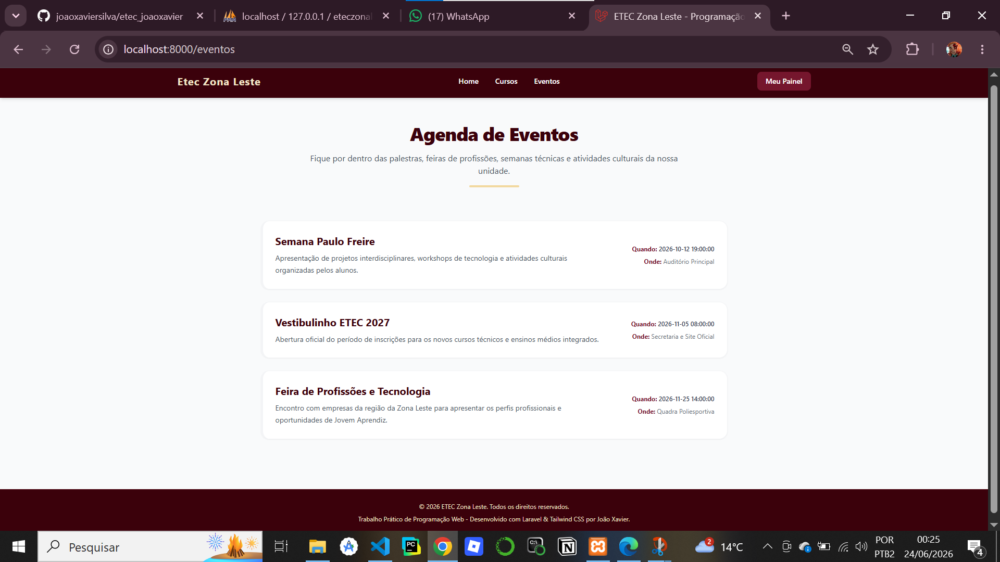
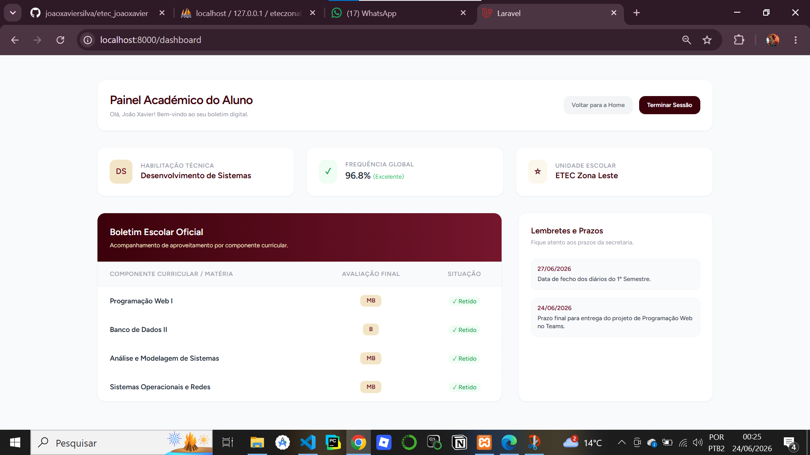
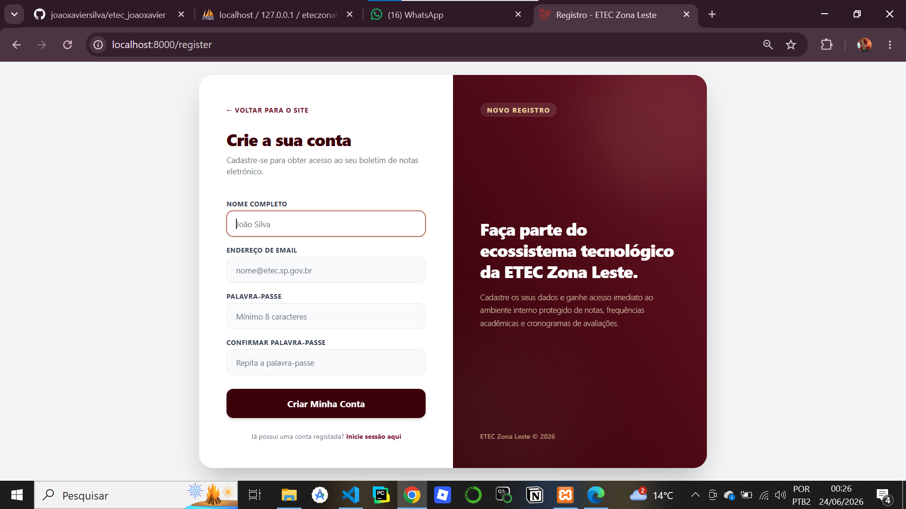
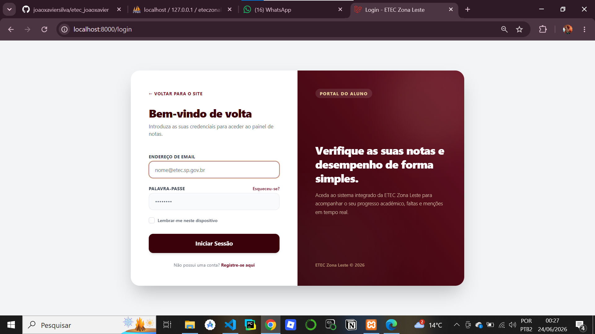

# Sistema de Portal Escolar - ETEC Zona Leste

Este é um sistema de portal acadêmico dinâmico desenvolvido como trabalho prático para a disciplina de **Programação Web**. A aplicação foi totalmente construída utilizando o ecossistema **Laravel 11**, com autenticação segura via **Laravel Breeze**, banco de dados **MySQL** via **Eloquent ORM**, e estilização responsiva através do **Tailwind CSS** (adotando a identidade visual baseada na paleta de cores *Burgundy* do Centro Paula Souza).

---

## Tecnologias e Ferramentas Utilizadas

* **PHP 8.2+**: Linguagem de programação do back-end.
* **Laravel 11**: Framework PHP utilizado para a arquitetura MVC.
* **Laravel Breeze**: Mecanismo de autenticação, controle de sessões e segurança de usuários.
* **Tailwind CSS**: Framework CSS utilitário para design, transições e responsividade.
* **Vite**: Ferramenta de build e compilação de assets front-end.
* **MySQL**: Sistema de gerenciamento de banco de dados relacional.

---

## Estrutura do Banco de Dados (Tabelas)

O banco de dados foi projetado de forma relacional para gerenciar tanto as informações institucionais públicas quanto os dados restritos dos alunos.

### 1. Tabela `users`

* `id` (Chave Primária, Autoincrementável)
* `name` (String - Nome completo do aluno)
* `email` (String - E-mail de acesso, único)
* `password` (String - Senha criptografada em hash)
* `timestamps` (`created_at` e `updated_at`)

### 2. Tabela `cursos`

* `id` (Chave Primária, Autoincrementável)
* `nome` (String - Nome do curso técnico, ex: Desenvolvimento de Sistemas)
* `descricao` (Text - Detalhes sobre o perfil e matriz do curso)
* `periodo` (String - Manhã/Tarde/Noite)
* `duracao` (String - Quantidade de semestres/anos)

### 3. Tabela `eventos`

* `id` (Chave Primária, Autoincrementável)
* `titulo` (String - Nome do evento acadêmico)
* `descricao` (Text - Detalhes e cronograma da atividade)
* `data_evento` (DateTime - Data e hora da realização)
* `local` (String - Espaço físico ou laboratório da ETEC)

### 4. Tabela `notas`

* `id` (Chave Primária, Autoincrementável)
* `user_id` (Chave Estrangeira - Relacionada à tabela `users` com deleção em cascata para integridade referencial)
* `materia` (String - Nome do componente curricular técnico)
* `mencao` (String - Menções padrão CPS: MB, B, R, I)

---

## Dicionário de Dados

Este dicionário descreve detalhadamente a tipagem, restrições e a finalidade de cada campo mapeado nas tabelas do banco de dados MySQL da aplicação.

### 1. Tabela: `users` (Alunos / Usuários)

| Campo | Tipo | Chave | Nulo | Padrão | Descrição |
| :--- | :--- | :---: | :---: | :---: | :--- |
| `id` | BIGINT UNSIGNED | PK | Não | *Auto_Increment* | Identificador único e exclusivo do aluno. |
| `name` | VARCHAR(255) | - | Não | - | Nome completo fornecido pelo aluno no cadastro. |
| `email` | VARCHAR(255) | UNIQUE | Não | - | E-mail institucional usado para login (único). |
| `email_verified_at` | TIMESTAMP | - | Sim | NULL | Registra a data/hora em que o e-mail foi verificado. |
| `password` | VARCHAR(255) | - | Não | - | Senha de acesso armazenada de forma segura (Hash). |
| `remember_token` | VARCHAR(100) | - | Sim | NULL | Token de segurança para a opção "Lembrar-me" no login. |
| `created_at` | TIMESTAMP | - | Sim | NULL | Data e hora em que a conta do aluno foi criada. |
| `updated_at` | TIMESTAMP | - | Sim | NULL | Data e hora da última modificação nos dados do aluno. |

### 2. Tabela: `cursos`

| Campo | Tipo | Chave | Nulo | Padrão | Descrição |
| :--- | :--- | :---: | :---: | :---: | :--- |
| `id` | BIGINT UNSIGNED | PK | Não | *Auto_Increment* | Identificador único do curso técnico. |
| `nome` | VARCHAR(255) | - | Não | - | Nome do curso ofertado pela instituição (ex: Desenvolvimento de Sistemas). |
| `descricao` | TEXT | - | Não | - | Detalhamento sobre a matriz curricular e perfil profissional do curso. |
| `periodo` | VARCHAR(255) | - | Não | - | Turno das aulas (Manhã, Tarde ou Noite). |
| `duracao` | VARCHAR(255) | - | Não | - | Tempo total estimado do curso (ex: 3 semestres). |
| `created_at` | TIMESTAMP | - | Sim | NULL | Registro de criação do curso no sistema. |
| `updated_at` | TIMESTAMP | - | Sim | NULL | Registro da última atualização do curso. |

### 3. Tabela: `eventos`

| Campo | Tipo | Chave | Nulo | Padrão | Descrição |
| :--- | :--- | :---: | :---: | :---: | :--- |
| `id` | BIGINT UNSIGNED | PK | Não | *Auto_Increment* | Identificador único do evento acadêmico. |
| `titulo` | VARCHAR(255) | - | Não | - | Nome do evento (ex: Semana Paulo Freire). |
| `descricao` | TEXT | - | Não | - | Informações complementares, regras ou cronograma da atividade. |
| `data_evento` | DATETIME | - | Não | - | Data e horário agendados para a realização do evento. |
| `local` | VARCHAR(255) | - | Não | - | Dependência física da ETEC onde ocorrerá (ex: Auditório, Quadra). |
| `created_at` | TIMESTAMP | - | Sim | NULL | Registro de criação do evento no sistema. |
| `updated_at` | TIMESTAMP | - | Sim | NULL | Registro da última atualização do evento. |

### 4. Tabela: `notas` (Boletim Escolar)

| Campo | Tipo | Chave | Nulo | Padrão | Descrição |
| :--- | :--- | :---: | :---: | :---: | :--- |
| `id` | BIGINT UNSIGNED | PK | Não | *Auto_Increment* | Identificador único do registro de nota. |
| `user_id` | BIGINT UNSIGNED | FK | Não | - | Chave Estrangeira que vincula a nota ao ID do aluno na tabela `users` (Deleção em Cascata ativa). |
| `materia` | VARCHAR(255) | - | Não | - | Nome da matéria/componente técnico curricular (ex: Banco de Dados II). |
| `mencao` | VARCHAR(255) | - | Não | - | Menção conceitual obtida pelo aluno (MB, B, R ou I). |
| `created_at` | TIMESTAMP | - | Sim | NULL | Data e hora em que a nota foi gerada no banco. |
| `updated_at` | TIMESTAMP | - | Sim | NULL | Data e hora da última alteração de menção (via phpMyAdmin ou sistema). |

## Lógica e Arquitetura do Sistema

O projeto segue estritamente o padrão arquitetural **MVC (Model-View-Controller)** para garantir o isolamento das responsabilidades:

1. **Camada de Dados (Model & Migrations)**: Os dados são estruturados via arquivos de Migration e manipulados de forma abstrata através do Eloquent ORM. Foi estabelecido um relacionamento avançado do tipo `hasMany` (Um para Muitos) de `User` para `Notas`, garantindo que cada aluno autenticado acesse exclusivamente o seu próprio conjunto de menções no banco.
2. **Camada de Controle (Controller)**: O `EtecController` concentra a inteligência de negócio das páginas públicas, realizando queries no MySQL e injetando as coleções diretamente nas views correspondentes.
3. **Camada de Apresentação (View)**: Construída com Blade engines do Laravel, aproveitando componentes reutilizáveis, layouts mestres para unificar o cabeçalho e rodapé Burgundy, e loops `@foreach` dinâmicos que renderizam as informações vindas do banco em tempo real.
4. **Camada de Segurança**: Proteção ativa contra falsificação de requisições utilizando tokens CSRF (`@csrf`) em formulários e configuração de campos `$fillable` nos Models para travar vulnerabilidades de Atribuição em Massa (Mass Assignment). O acesso ao painel do aluno é blindado por um Middleware de autenticação (`auth`).

---

## Explicação Detalhada de Cada Arquivo Estrutural

### Camada de Modelagem (Models)

* **`app/Models/User.php`**: Representa o aluno no sistema. Contém a configuração de campos preenchíveis e o método de relacionamento `notas()`, que declara que um usuário possui muitas notas (`hasMany`).
* **`app/Models/Curso.php`**: Gerencia a tabela `cursos`. Contém a propriedade `$fillable` para os campos `nome`, `descricao`, `periodo` e `duracao`, protegendo a persistência de dados.
* **`app/Models/Evento.php`**: Mapeia a tabela `eventos` e encapsula seus atributos como preenchíveis em massa.
* **`app/Models/Nota.php`**: Mapeia a tabela de menções acadêmicas. Armazena as chaves de ligação com o aluno e os dados de componentes e conceitos (MB, B, R, I).

### Camada de Controle (Controllers)

* **`app/Http/Controllers/EtecController.php`**: Centraliza as requisições das páginas institucionais. Contém os métodos que consultam o banco de dados (ex: `Curso::all()`) e retornam as respectivas views passando esses dados dinâmicos como parâmetro.

### Camada de Roteamento (Routes)

* **`routes/web.php`**: Define o mapa de URLs da aplicação. Configura as rotas públicas (Home, Cursos, Eventos), a rota protegida por middleware para o Dashboard do aluno, e a rota de `fallback` que captura qualquer endereço inexistente e redireciona de forma elegante para a página de erro 404 customizada.

### Camada de Banco de Dados (Database)

* **`database/migrations/..._create_cursos_table.php`**: Define a estrutura física da tabela de cursos com suas colunas e tipos de dados no MySQL.
* **`database/migrations/..._create_eventos_table.php`**: Define a estrutura física da tabela de eventos institucionais.
* **`database/migrations/..._create_notas_table.php`**: Define a estrutura física da tabela de notas, estabelecendo a constraint de chave estrangeira `user_id` apontando para a tabela `users`.
* **`database/seeders/DatabaseSeeder.php`**: Popula o banco de dados automaticamente com registros iniciais de teste para cursos e eventos através do mecanismo de Seeds. Também gerencia a inserção das notas padrões do semestre assim que um novo aluno efetua o cadastro pelo portal.

### Camada de Apresentação (Views Públicas e Customizadas)

* **`resources/views/home.blade.php`**: Página inicial do portal, contendo os elementos visuais institucionais, missão da ETEC e botões de chamada para ação (Acesso ao Aluno).
* **`resources/views/cursos.blade.php`**: Renderiza a listagem de cursos em formato de cards responsivos Tailwind, percorrendo os dados do banco dinamicamente via `@foreach`.
* **`resources/views/eventos.blade.php`**: Exibe o cronograma de eventos da escola puxados do MySQL de forma organizada por data e local.
* **`resources/views/errors/404.blade.php`**: View customizada de erro que captura requisições inválidas, exibindo uma mensagem amigável integrada ao layout visual do portal em vez do erro padrão do servidor.

### Camada de Autenticação e Segurança (Laravel Breeze Customizado)

* **`resources/views/dashboard.blade.php`**: O painel restrito do aluno, onde é impresso o boletim escolar personalizado com as notas salvas no banco de dados vinculadas ao seu ID.
* **`resources/views/auth/login.blade.php`**: Tela de login institucional adaptada para a identidade visual Burgundy, com inputs limpos e cantos arredondados.
* **`resources/views/auth/register.blade.php`**: Formulário de matrícula/cadastro de novos alunos no sistema.
* **`resources/views/auth/forgot-password.blade.php`**: Interface amigável de solicitação de recuperação de credenciais para envio de link de reset.
* **`resources/views/auth/reset-password.blade.php`**: Tela física de redefinição de senha com validações visuais de segurança e foco controlado.
* **`resources/views/auth/confirm-password.blade.php`**: Barreira de segurança para confirmação de senha institucional antes de acessar dados críticos.
* **`resources/views/auth/verify-email.blade.php`**: Tela de aviso pós-cadastro que solicita a verificação do e-mail acadêmico para ativação completa da conta.

---

## Demonstração Visual das Telas (Views)

Abaixo estão os registros visuais da interface do sistema, organizados de acordo com o fluxo de navegação do usuário:

### Página Inicial (Home)


### Cursos Ofertados


### Eventos Acadêmicos


### Painel do Aluno (Dashboard)


### Cadastro de Aluno (Registro)


### Acesso ao Sistema (Login)


---

## Como Executar o Projeto Localmente

1. **Clonar o Repositório**:
```bash
git clone https://github.com/seu-usuario/seu-repositorio.git
cd seu-repositorio
```

2. **Instalar Dependências**:

``` bash
composer install
npm install
```

3. **Ambiente e Banco de Dados**:
* Copie o arquivo `.env.example` para `.env`
* Configure a conexão com o seu banco MySQL local:
```env
DB_CONNECTION=mysql
DB_HOST=127.0.0.1
DB_PORT=3306
DB_DATABASE=eteczonaleste_joaoxavier
DB_USERNAME=root
DB_PASSWORD=
```

4. **Gerar Chave e Rodar Migrations com Seeds**:
```bash
php artisan key:generate
php artisan migrate --seed
```

5. **Iniciar Servidores**:
* Terminal: `composer run dev`
